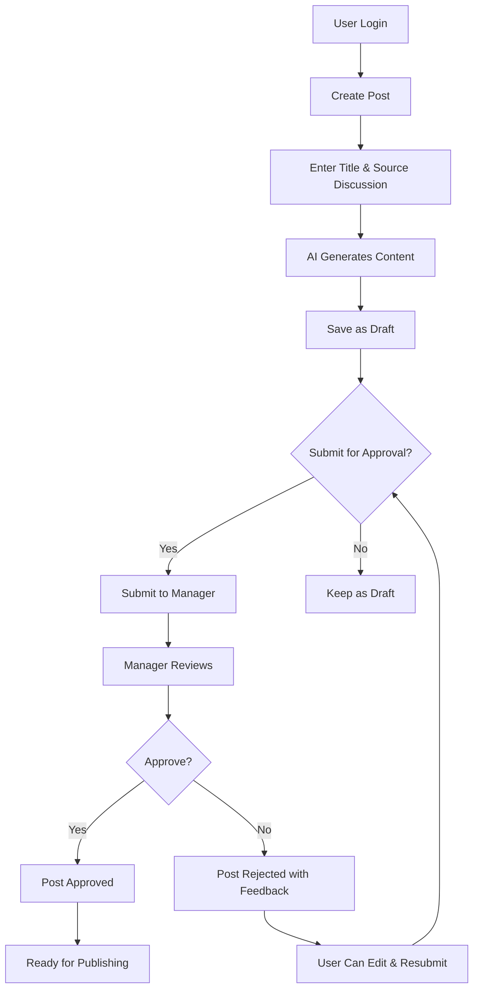

# AI Auto Poster 🚀

A comprehensive, enterprise-grade web application for AI-powered LinkedIn content generation with advanced approval workflows, organizational hierarchy management, and professional user experience.

## ✨ Key Features Overview

### 🤖 AI-Powered Content Generation
- **Multi-API Support**: OpenAI and Azure OpenAI integration with automatic fallback
- **Intelligent Content Creation**: Generates engaging LinkedIn posts from simple inputs
- **Platform Optimization**: Content tailored specifically for LinkedIn engagement
- **Fallback System**: Graceful degradation when AI APIs are unavailable

### 👥 Organizational Hierarchy & Role Management
- **Three-Tier Role System**: Admin → Manager → User hierarchy
- **Manager Assignment**: Users are assigned to specific managers during registration
- **Role-Based Access Control**: Granular permissions based on organizational position
- **Team Management**: Managers oversee their assigned team members

### ✅ Advanced Approval Workflow
- **Hierarchical Approval**: Posts flow through proper organizational channels
- **Approval Tracking**: Complete audit trail with approver identity and timestamps
- **Feedback System**: Managers can provide detailed feedback on rejections
- **Status Management**: Real-time status updates throughout the approval process
- **Edit Protection**: Approved posts cannot be edited to maintain integrity

### 📊 Professional Dashboard & Analytics
- **Real-Time Statistics**: Live counts of posts by status
- **Workflow Metrics**: Track pending approvals, approved posts, and published content
- **Recent Activity**: Quick overview of latest posts and activities
- **Role-Specific Views**: Customized dashboard based on user role

### 🎨 Modern User Interface & Experience
- **Professional Design**: Clean, modern interface with gradient cards and animations
- **Responsive Layout**: Works seamlessly on desktop, tablet, and mobile devices
- **Loading Animations**: Context-aware loading spinners with dynamic messages
- **Notification System**: Toast notifications for all user actions
- **Scrollable Content**: Prevents page overflow with elegant scrolling containers
=======
# AI Auto Poster

A comprehensive web application for AI-powered content generation and LinkedIn posting with approval workflows.

## Features

- **AI Content Generation**: Automatically generates LinkedIn posts using AI APIs
- **Approval Workflow**: Manager approval system for all posts
- **Scheduling**: Schedule posts for future publication
- **Notifications**: Real-time notifications for approval requests and status updates
- **User Management**: Role-based access control (Admin, Manager, User)
- **Dashboard**: Comprehensive dashboard with statistics and recent activity
>>>>>>> remotes/origin/akash_dev

## Technology Stack

### Backend
- Java 8
- Spring Boot 2.2.6.RELEASE
- Spring Security with JWT
- Spring Data JPA
- MySQL Database
- Maven

### Frontend
- HTML5
<<<<<<< HEAD
- Tailwind CSS 3.x
- Alpine.js 3.x
- Font Awesome Icons
- Custom CSS animations and transitions

## 🔥 Detailed Feature Breakdown

### 🎯 Post Management System

#### Post Creation & Editing
- **Smart Form Validation**: Real-time validation with user-friendly error messages
- **AI Content Generation**: Automatic LinkedIn post generation from title and source discussion
- **Multi-Platform Support**: Configurable target platforms (LinkedIn primary)
- **Draft System**: Save posts as drafts before submission
- **Edit Functionality**: Full CRUD operations with proper entity management
- **Content Regeneration**: AI content automatically regenerated on post updates

#### Post Status Workflow
```
DRAFT → PENDING_APPROVAL → APPROVED → PUBLISHED
   ↓           ↓              ↓
REJECTED ← REJECTED      REJECTED
```

- **DRAFT**: Initial state, can be edited and submitted for approval
- **PENDING_APPROVAL**: Awaiting manager review
- **APPROVED**: Manager approved, ready for publishing
- **REJECTED**: Manager rejected with feedback
- **PUBLISHED**: Live on LinkedIn

#### Advanced Post Features
- **Approval Information Display**: Shows who approved posts and when
- **Edit Protection**: Approved/published posts cannot be edited
- **Content Versioning**: Maintains history of AI-generated content
- **Bulk Operations**: Support for multiple post management
- **Search & Filter**: Filter posts by status, date, or content

### 🏢 Organizational Management

#### User Registration & Management
- **Role Selection**: Choose from User, Manager, or Admin roles
- **Manager Assignment**: Users select their reporting manager during registration
- **Department Organization**: Optional department-based grouping
- **Profile Management**: Update user information and preferences

#### Hierarchical Access Control
- **Users**: Can only see and manage their own posts
- **Managers**: Access to their team members' posts + own posts
- **Admins**: Full system access to all posts and users

#### Team Structure
```
Admin (Global Access)
  ├── Manager A (Team A Access)
  │   ├── User 1
  │   ├── User 2
  │   └── User 3
  └── Manager B (Team B Access)
      ├── User 4
      └── User 5
```

### 🔄 Approval Workflow System

#### Approval Request Management
- **Automatic Routing**: Posts automatically routed to assigned manager
- **Approval Queue**: Managers see all pending requests from their team
- **Content Review**: Full post content and AI-generated material review
- **Approval Actions**: Approve or reject with detailed feedback
- **Notification System**: Real-time notifications for all stakeholders

#### Approval Features
- **View Content Modal**: Detailed review interface for approval requests
- **Feedback System**: Rich text feedback for rejected posts
- **Approval History**: Complete audit trail of all approval decisions
- **Bulk Approval**: Process multiple requests efficiently
- **Approval Analytics**: Track approval rates and processing times

### 📈 Dashboard & Analytics

#### Statistics Cards
1. **Total Posts** (Blue): All posts in the system
2. **Pending Approvals** (Orange): Posts awaiting review
3. **Approved Posts** (Teal): Posts approved and ready to publish
4. **Published Posts** (Green): Live posts on LinkedIn
5. **Total Views** (Purple): Engagement metrics

#### Recent Activity
- **Recent Posts Sidebar**: Latest posts with status indicators
- **Activity Feed**: Real-time updates on post activities
- **Quick Actions**: Direct access to common operations
- **Performance Metrics**: Key performance indicators

### 🎨 User Interface Enhancements

#### Loading & Feedback System
- **Global Loading Overlay**: Context-aware loading spinners
- **Dynamic Messages**: Different messages for different operations
  - Login: "Authenticating your credentials..."
  - Registration: "Creating your account..."
  - Post Creation: "AI is creating amazing content for you!"
  - Post Update: "AI is regenerating content based on your changes!"
  - Approval: "Processing your approval request..."

#### Professional Design Elements
- **Gradient Cards**: Beautiful gradient backgrounds for statistics
- **Hover Effects**: Interactive elements with smooth transitions
- **Icon System**: Consistent Font Awesome icon usage
- **Color Coding**: Intuitive color schemes for different states
- **Animation System**: Smooth animations for better user experience

#### Responsive & Scalable UI
- **Scrollable Containers**: Prevents page overflow with elegant scrolling
  - Main Posts List: 384px max height
  - Recent Posts: 256px max height
  - Approval Requests: 384px max height
- **Mobile Responsive**: Works on all device sizes
- **Performance Optimized**: Efficient rendering for large datasets

### 🔐 Security & Authentication

#### JWT-Based Authentication
- **Secure Login**: JWT token-based authentication
- **Session Persistence**: Automatic login restoration on page refresh
- **Token Validation**: Server-side token verification
- **Logout Management**: Secure session termination

#### Role-Based Security
- **Endpoint Protection**: API endpoints secured by role
- **UI Access Control**: Frontend elements shown based on permissions
- **Data Isolation**: Users only see data they're authorized to access
- **Audit Trail**: Complete logging of user actions

### 🔧 Technical Improvements

#### Backend Enhancements
- **Proper Entity Management**: Fixed JPA entity update issues
- **Transaction Management**: Proper database transaction handling
- **Error Handling**: Comprehensive error handling and logging
- **API Optimization**: Efficient database queries and caching

#### Frontend Optimizations
- **State Management**: Proper Alpine.js state management
- **Memory Management**: Efficient DOM manipulation
- **Performance**: Optimized rendering and data loading
- **Accessibility**: Screen reader friendly and keyboard navigation

#### Bug Fixes & Stability
- **Post Update Fix**: Resolved post disappearing after updates
- **Loading Overlay Fix**: Fixed z-index issues with modals
- **Authentication Persistence**: Fixed login state restoration
- **Form Validation**: Enhanced client-side validation
- **Error Messaging**: User-friendly error messages throughout
=======
- Tailwind CSS
- Alpine.js
- Font Awesome Icons
>>>>>>> remotes/origin/akash_dev

## Database Schema

The application uses the following main entities:

- **USERS**: User management with roles and hierarchy
- **POSTS**: Post content and metadata
- **POST_CONTENT**: Platform-specific content generated by AI
- **IMAGES**: Associated images for posts
- **SCHEDULE**: Post scheduling information
- **NOTIFICATIONS**: User notifications
- **AI_WORKFLOW_STEPS**: AI generation workflow tracking
- **APPROVAL_REQUESTS**: Approval workflow management

## Setup Instructions

### Prerequisites

1. Java 8 or higher
2. MySQL 8.0 or higher
3. Maven 3.6 or higher

### Database Setup

1. Create a MySQL database named `ai_auto_poster`:
```sql
CREATE DATABASE ai_auto_poster;
```

2. Update the database configuration in `src/main/resources/application.yml`:
```yaml
spring:
  datasource:
    url: jdbc:mysql://localhost:3306/ai_auto_poster?useSSL=false&serverTimezone=UTC&createDatabaseIfNotExist=true
    username: your_username
    password: your_password
```

### Environment Variables

The application is pre-configured with working API credentials, but you can override them with environment variables:

```bash
# AI API Configuration (Pre-configured)
# OpenAI API
AI_OPENAI_APIKEY=API_Key
AI_OPENAI_URL=API_URL

# Azure OpenAI API (Fallback)
AI_AZURE_APIKEY=API_KEY
AI_AZURE_URL=API_URL

# LinkedIn API Configuration
LINKEDIN_CLIENT_ID=your_linkedin_client_id
LINKEDIN_CLIENT_SECRET=your_linkedin_client_secret
LINKEDIN_REDIRECT_URI=http://localhost:8080/auth/linkedin/callback

# JWT Configuration
JWT_SECRET=your_jwt_secret_key

# Email Configuration
MAIL_USERNAME=your_email@gmail.com
MAIL_PASSWORD=your_app_password
```

**Note**: The application will automatically try both OpenAI and Azure OpenAI APIs, using whichever one is working. If both fail, it will generate fallback content.

### Running the Application

1. Clone the repository:
```bash
git clone <repository-url>
cd ai-auto-poster-pro
```

2. Build the application:
```bash
mvn clean install
```

3. Run the application:
```bash
mvn spring-boot:run
```

4. Access the application at: `http://localhost:8080`

<<<<<<< HEAD
## 🔌 API Endpoints Documentation

### 🔐 Authentication Endpoints
```http
POST /api/auth/login
Content-Type: application/json
{
  "email": "user@example.com",
  "password": "password123"
}
Response: { "token": "jwt_token", "user": {...} }

POST /api/auth/register
Content-Type: application/json
{
  "email": "user@example.com",
  "password": "password123",
  "department": "Marketing",
  "role": "USER",
  "managerId": 2
}

POST /api/auth/validate
Authorization: Bearer {jwt_token}
Response: { "valid": true, "user": {...} }
```

### 👥 User Management Endpoints
```http
GET /api/users
Authorization: Bearer {jwt_token}
Response: [{ "id": 1, "email": "...", "role": "..." }]

GET /api/users/managers
Authorization: Bearer {jwt_token}
Response: [{ "id": 2, "email": "manager@example.com", "role": "MANAGER" }]

POST /api/users
Authorization: Bearer {jwt_token}
Content-Type: application/json
{
  "email": "newuser@example.com",
  "password": "password123",
  "role": "USER",
  "managerId": 2
}
```

### 📝 Post Management Endpoints
```http
GET /api/posts
Authorization: Bearer {jwt_token}
Response: [{ "id": 1, "title": "...", "currentStatus": "DRAFT" }]

GET /api/posts/user/{userId}
Authorization: Bearer {jwt_token}
Response: [{ "id": 1, "title": "...", "createdBy": userId }]

GET /api/posts/manager/{managerId}
Authorization: Bearer {jwt_token}
Response: [{ posts from manager's team members }]

POST /api/posts
Authorization: Bearer {jwt_token}
Content-Type: application/json
{
  "title": "My LinkedIn Post",
  "sourceDiscussion": "Discussion about AI trends",
  "targetPlatforms": "linkedin"
}

PUT /api/posts/{id}
Authorization: Bearer {jwt_token}
Content-Type: application/json
{
  "title": "Updated Title",
  "sourceDiscussion": "Updated discussion",
  "targetPlatforms": "linkedin"
}

POST /api/posts/{id}/submit-approval
Authorization: Bearer {jwt_token}
Response: { "message": "Post submitted for approval" }

POST /api/posts/{id}/approve
Authorization: Bearer {jwt_token}
Response: { "message": "Post approved successfully" }

POST /api/posts/{id}/reject?feedback=reason
Authorization: Bearer {jwt_token}
Response: { "message": "Post rejected" }
```

### ✅ Approval Management Endpoints
```http
GET /api/approvals
Authorization: Bearer {jwt_token} (Admin only)
Response: [{ "id": 1, "post": {...}, "status": "PENDING" }]

GET /api/approvals/manager/{managerId}/pending
Authorization: Bearer {jwt_token}
Response: [{ pending approvals for manager's team }]

GET /api/approvals/manager/{managerId}/pending/count
Authorization: Bearer {jwt_token}
Response: 5

GET /api/approvals/{id}/content
Authorization: Bearer {jwt_token}
Response: [{ "platform": "linkedin", "content": "..." }]

POST /api/approvals/{id}/approve
Authorization: Bearer {jwt_token}
Response: { "message": "Approval request approved" }

POST /api/approvals/{id}/reject?feedback=reason
Authorization: Bearer {jwt_token}
Response: { "message": "Approval request rejected" }
```

### 🔔 Notification Endpoints
```http
GET /api/notifications/user/{userId}
Authorization: Bearer {jwt_token}
Response: [{ "id": 1, "message": "...", "readStatus": false }]

PUT /api/notifications/{id}/read
Authorization: Bearer {jwt_token}
Response: { "message": "Notification marked as read" }

PUT /api/notifications/user/{userId}/read-all
Authorization: Bearer {jwt_token}
Response: { "message": "All notifications marked as read" }
```

### 📅 Scheduling Endpoints
```http
GET /api/schedules
Authorization: Bearer {jwt_token}
Response: [{ "id": 1, "post": {...}, "scheduledFor": "2024-01-01T10:00:00" }]

POST /api/schedules
Authorization: Bearer {jwt_token}
Content-Type: application/json
{
  "postId": 1,
  "scheduledFor": "2024-01-01T10:00:00",
  "platforms": ["linkedin"]
}

POST /api/schedules/post/{postId}
Authorization: Bearer {jwt_token}
Content-Type: application/json
{
  "scheduledFor": "2024-01-01T10:00:00"
}

PUT /api/schedules/{id}/cancel
Authorization: Bearer {jwt_token}
Response: { "message": "Schedule cancelled" }
```

## 🔄 Complete Workflow Documentation

### 📝 Post Creation Workflow


### 👥 User Role Workflows

#### 🔵 USER Role Workflow
1. **Registration**: Select manager during signup
2. **Post Creation**: Create posts with AI assistance
3. **Draft Management**: Save and edit drafts
4. **Submission**: Submit posts for manager approval
5. **Feedback Handling**: Receive and act on manager feedback
6. **Monitoring**: Track post status and approval progress

#### 🟡 MANAGER Role Workflow
1. **Team Overview**: View all team member posts
2. **Approval Queue**: Review pending approval requests
3. **Content Review**: Examine AI-generated content
4. **Decision Making**: Approve or reject with detailed feedback
5. **Team Management**: Monitor team post performance
6. **Own Posts**: Create and manage personal posts

#### 🔴 ADMIN Role Workflow
1. **System Overview**: Access all posts and users
2. **User Management**: Create, edit, and manage all users
3. **Global Approvals**: Handle any approval requests
4. **System Monitoring**: Track overall system performance
5. **Configuration**: Manage system settings and integrations

### 🎯 Detailed Process Flows

#### Post Creation Process
1. **Login** → User authenticates with JWT token
2. **Navigate** → Go to Posts tab and click "Create New Post"
3. **Form Input** → Enter post title and source discussion
4. **AI Processing** → System generates LinkedIn-optimized content
5. **Review** → User reviews generated content
6. **Save** → Post saved as DRAFT status
7. **Submit** → User clicks "Submit for Approval"
8. **Routing** → Post automatically routed to assigned manager

#### Approval Process
1. **Notification** → Manager receives approval request notification
2. **Review** → Manager opens approval modal to review content
3. **Decision** → Manager chooses to approve or reject
4. **Feedback** → If rejected, manager provides detailed feedback
5. **Status Update** → Post status updated (APPROVED/REJECTED)
6. **Notification** → User notified of decision
7. **Next Steps** → Approved posts ready for publishing, rejected posts can be edited

#### Edit & Update Process
1. **Access Control** → Only DRAFT/PENDING_APPROVAL/REJECTED posts can be edited
2. **Form Population** → Edit form populated with existing data
3. **Modification** → User updates title and/or source discussion
4. **AI Regeneration** → System regenerates content based on changes
5. **Entity Management** → Backend properly updates existing post (preserves ID)
6. **Status Preservation** → Post maintains proper ownership and timestamps

### 🔐 Security & Permission Matrix

| Action | USER | MANAGER | ADMIN |
|--------|------|---------|-------|
| Create Posts | ✅ Own | ✅ Own | ✅ Any |
| View Posts | ✅ Own | ✅ Team + Own | ✅ All |
| Edit Posts | ✅ Own (Draft/Rejected) | ✅ Own (Draft/Rejected) | ✅ Any (Draft/Rejected) |
| Submit for Approval | ✅ Own | ✅ Own | ✅ Any |
| Approve Posts | ❌ | ✅ Team Posts | ✅ Any |
| Reject Posts | ❌ | ✅ Team Posts | ✅ Any |
| View Approvals | ❌ | ✅ Team Requests | ✅ All Requests |
| Manage Users | ❌ | ❌ | ✅ All |
| System Settings | ❌ | ❌ | ✅ All |
=======
## API Endpoints

### Authentication
- `POST /api/auth/login` - User login
- `POST /api/auth/register` - User registration
- `POST /api/auth/validate` - Token validation

### Users
- `GET /api/users` - Get all users
- `POST /api/users` - Create user
- `GET /api/users/{id}` - Get user by ID
- `PUT /api/users/{id}` - Update user
- `DELETE /api/users/{id}` - Delete user

### Posts
- `GET /api/posts` - Get all posts
- `POST /api/posts` - Create post
- `GET /api/posts/{id}` - Get post by ID
- `PUT /api/posts/{id}` - Update post
- `POST /api/posts/{id}/submit-approval` - Submit for approval
- `POST /api/posts/{id}/approve` - Approve post
- `POST /api/posts/{id}/reject` - Reject post

### Approvals
- `GET /api/approvals` - Get all approval requests
- `GET /api/approvals/manager/{managerId}/pending` - Get pending approvals for manager
- `POST /api/approvals/{id}/approve` - Approve request
- `POST /api/approvals/{id}/reject` - Reject request

### Notifications
- `GET /api/notifications/user/{userId}` - Get user notifications
- `PUT /api/notifications/{id}/read` - Mark notification as read
- `PUT /api/notifications/user/{userId}/read-all` - Mark all notifications as read

### Schedules
- `GET /api/schedules` - Get all schedules
- `POST /api/schedules` - Create schedule
- `POST /api/schedules/post/{postId}` - Schedule post
- `PUT /api/schedules/{id}/cancel` - Cancel schedule

## Workflow

1. **Post Creation**: User creates a post with title and source discussion
2. **AI Generation**: System automatically generates LinkedIn content using AI
3. **Approval Request**: Post is submitted for manager approval
4. **Manager Review**: Manager can approve or reject with feedback
5. **Scheduling**: Approved posts can be scheduled for publication
6. **Publication**: Scheduled posts are automatically published to LinkedIn
7. **Notifications**: All stakeholders receive notifications throughout the process

## User Roles

- **ADMIN**: Full system access
- **MANAGER**: Can approve posts from their team members
- **USER**: Can create posts and submit for approval
>>>>>>> remotes/origin/akash_dev

## Configuration

### AI API Integration

The application supports both OpenAI and Azure OpenAI for content generation with automatic fallback:

```yaml
ai:
  openai:
    apiKey: API_KEY
    url: API_URL
  azure:
    apiKey: API_KEY
    url: API_URL
```

The system will:
1. Try OpenAI API first
2. Fall back to Azure OpenAI if OpenAI fails
3. Generate fallback content if both APIs fail

### LinkedIn Integration

Configure LinkedIn OAuth for posting:

```yaml
linkedin:
  client:
    id: ${LINKEDIN_CLIENT_ID:your-linkedin-client-id}
    secret: ${LINKEDIN_CLIENT_SECRET:your-linkedin-client-secret}
    redirect-uri: ${LINKEDIN_REDIRECT_URI:http://localhost:8080/auth/linkedin/callback}
```

## Development

### Project Structure

```
src/
├── main/
│   ├── java/com/aiautoposter/
│   │   ├── config/          # Configuration classes
│   │   ├── controller/      # REST controllers
│   │   ├── entity/          # JPA entities
│   │   ├── repository/      # JPA repositories
│   │   ├── security/        # Security configuration
│   │   └── service/         # Business logic services
│   └── resources/
│       ├── templates/       # Thymeleaf templates
│       └── application.yml  # Application configuration
```

### Adding New Features

1. Create entity classes in the `entity` package
2. Create repository interfaces in the `repository` package
3. Implement business logic in the `service` package
4. Create REST endpoints in the `controller` package
5. Update the frontend templates as needed

<<<<<<< HEAD
## 🛠️ Troubleshooting Guide

### 🚨 Common Issues & Solutions

#### Authentication Issues
```bash
# Issue: "Invalid token" or login failures
# Solution: Check JWT configuration and token expiration
# Debug: Check browser console for token validation errors

# Issue: Session not persisting after page refresh
# Solution: Verify localStorage token storage and validation endpoint
# Debug: Check browser Application tab → Local Storage
```

#### Post Management Issues
```bash
# Issue: Posts disappearing after update
# Root Cause: JPA entity management creating new entities instead of updating
# Solution: Ensure proper entity fetching and field preservation in updatePost()
# Debug: Check console logs for "=== UPDATE POST SERVICE ===" messages

# Issue: Edit button not showing for approved posts
# Expected: Edit protection working correctly
# Verify: Only DRAFT/PENDING_APPROVAL/REJECTED posts should be editable

# Issue: AI content not generating
# Solution: Check AI API configuration and fallback mechanisms
# Debug: Monitor console for AI generation errors
```

#### UI/UX Issues
```bash
# Issue: Loading spinner appearing behind modals
# Solution: Ensure loading overlay has higher z-index (z-[9999])
# Verify: Loading spinner should appear on top of all content

# Issue: Long lists causing page overflow
# Solution: Scrollable containers with max-height restrictions
# Verify: Posts list, approvals, and recent posts should scroll independently

# Issue: Incorrect loading messages
# Solution: Ensure proper currentOperation and loadingMessage settings
# Debug: Check that each form submission sets appropriate loading state
```

#### Database Issues
```bash
# Issue: Connection refused
# Solution: Verify MySQL service is running
sudo systemctl status mysql
sudo systemctl start mysql

# Issue: Schema not created
# Solution: Enable auto-DDL in application.yml
spring.jpa.hibernate.ddl-auto: update

# Issue: Data not persisting
# Solution: Check transaction management and entity relationships
# Debug: Enable SQL logging to see actual queries
```

#### API Integration Issues
```bash
# Issue: AI API failures
# Solution: Verify API keys and endpoints
# Check: Both OpenAI and Azure OpenAI configurations
# Fallback: System should generate fallback content if APIs fail

# Issue: LinkedIn OAuth not working
# Solution: Verify client ID, secret, and redirect URI
# Check: LinkedIn app configuration matches application settings
```

### 🔍 Debugging Tools & Techniques

#### Frontend Debugging
```javascript
// Enable detailed console logging
localStorage.setItem('debug', 'true');

// Check Alpine.js state
// In browser console:
$el._x_dataStack[0] // Access Alpine.js data

// Monitor API calls
// Network tab in browser dev tools
// Look for failed requests and response codes
```

#### Backend Debugging
```yaml
# Enable SQL logging in application.yml
logging:
  level:
    org.hibernate.SQL: DEBUG
    org.hibernate.type.descriptor.sql.BasicBinder: TRACE
    com.aiautoposter: DEBUG

# Enable Spring Security debugging
logging:
  level:
    org.springframework.security: DEBUG
```

#### Database Debugging
```sql
-- Check user hierarchy
SELECT u.id, u.email, u.role, u.managerId, m.email as managerEmail 
FROM users u 
LEFT JOIN users m ON u.managerId = m.id;

-- Check post ownership and status
SELECT p.id, p.title, p.currentStatus, p.createdBy, u.email 
FROM posts p 
JOIN users u ON p.createdBy = u.id 
ORDER BY p.createdAt DESC;

-- Check approval workflow
SELECT a.id, a.status, p.title, u.email as requester, m.email as manager
FROM approval_requests a
JOIN posts p ON a.postId = p.id
JOIN users u ON p.createdBy = u.id
JOIN users m ON u.managerId = m.id;
```

### 📊 Performance Monitoring

#### Key Metrics to Monitor
- **Response Times**: API endpoint performance
- **Database Queries**: N+1 query problems
- **Memory Usage**: Frontend state management
- **Error Rates**: Failed API calls and exceptions

#### Performance Optimization Tips
```java
// Backend optimizations
@Query("SELECT p FROM Post p JOIN FETCH p.content WHERE p.createdBy = :userId")
List<Post> findByCreatedByWithContent(@Param("userId") Long userId);

// Use pagination for large datasets
Pageable pageable = PageRequest.of(0, 20);
Page<Post> posts = postRepository.findAll(pageable);
```

```javascript
// Frontend optimizations
// Debounce search inputs
const debouncedSearch = debounce((query) => {
    this.searchPosts(query);
}, 300);

// Lazy load content
x-intersect="loadMorePosts()"
```

### 🔧 Development Environment Setup

#### IDE Configuration
```bash
# IntelliJ IDEA settings
# Enable annotation processing for Lombok
# Configure code style for consistent formatting
# Set up database connection for easy debugging

# VS Code extensions
# Java Extension Pack
# Spring Boot Extension Pack
# MySQL extension for database management
```

#### Local Development Tips
```bash
# Use profiles for different environments
# application-dev.yml for development
# application-prod.yml for production

# Hot reload for faster development
spring.devtools.restart.enabled=true
spring.devtools.livereload.enabled=true

# Database seeding for testing
# Create data.sql with sample users and posts
# Enable spring.jpa.defer-datasource-initialization=true
```

### 📝 Testing Strategies

#### Unit Testing
```java
@Test
public void testPostCreation() {
    Post post = new Post();
    post.setTitle("Test Post");
    post.setSourceDiscussion("Test Discussion");
    
    Post savedPost = postService.createPost(post);
    
    assertNotNull(savedPost.getId());
    assertEquals("Test Post", savedPost.getTitle());
}
```

#### Integration Testing
```java
@SpringBootTest
@AutoConfigureTestDatabase
class PostControllerIntegrationTest {
    
    @Test
    void shouldCreatePostWithAuthentication() {
        // Test complete post creation workflow
        // Including authentication, AI generation, and database persistence
    }
}
```

#### Frontend Testing
```javascript
// Test Alpine.js components
// Use browser dev tools to verify state changes
// Test responsive design on different screen sizes
// Verify accessibility with screen readers
```

## 🚀 Recent Enhancements & Bug Fixes

### ✅ Major Features Implemented

#### 🔧 Critical Bug Fixes
- **Post Update Entity Management**: Fixed JPA entity creation issue where updates created new posts instead of updating existing ones
- **Authentication Persistence**: Resolved login state restoration on page refresh
- **Loading Overlay Z-Index**: Fixed loading spinner appearing behind modals
- **Edit Functionality**: Comprehensive edit post workflow with proper validation and AI content regeneration

#### 🎨 UI/UX Enhancements
- **Global Loading System**: Context-aware loading spinners with dynamic messages for all form submissions
- **Professional Design**: Modern gradient cards, hover effects, and smooth animations
- **Scrollable Content**: Implemented elegant scrolling for long lists to prevent page overflow
- **Enhanced Icons**: Improved action button icons with hover effects and tooltips
- **Date/Time Display**: Full timestamp display instead of date-only across the application

#### 👥 Organizational Features
- **Hierarchical User Management**: Proper Admin → Manager → User hierarchy with role-based access
- **Manager Assignment**: Users select managers during registration for proper organizational structure
- **Role-Based Post Access**: Users see only their posts, managers see team posts, admins see all posts
- **Edit Protection**: Approved and published posts cannot be edited to maintain workflow integrity

#### 📊 Dashboard Improvements
- **Approved Posts Card**: New statistics card showing approved posts count with teal gradient design
- **Real-Time Statistics**: Live counts for total posts, pending approvals, approved posts, published posts
- **Approval Information**: Display of who approved posts and when, with complete audit trail
- **Enhanced Analytics**: Comprehensive workflow metrics and performance indicators

#### 🔄 Workflow Enhancements
- **Smart Filter Management**: Automatic filter switching to ensure updated posts remain visible
- **Approval Tracking**: Complete audit trail with approver identity and timestamps
- **Status Management**: Proper post status workflow with validation and protection
- **Notification System**: Toast notifications for all user actions with appropriate messaging

### 🎯 Key Technical Achievements

#### Backend Improvements
- **Proper Entity Management**: Fixed JPA update operations to preserve entity relationships
- **Transaction Handling**: Improved database transaction management and error handling
- **API Optimization**: Enhanced endpoint performance and response handling
- **Security Enhancement**: Robust JWT authentication with proper session management

#### Frontend Optimizations
- **State Management**: Proper Alpine.js state management with memory optimization
- **Performance**: Efficient DOM manipulation and data loading strategies
- **Accessibility**: Screen reader friendly interface with keyboard navigation support
- **Responsive Design**: Mobile-first approach with cross-device compatibility

#### User Experience
- **Professional Loading States**: Context-aware feedback for all operations
- **Error Handling**: User-friendly error messages with actionable guidance
- **Intuitive Navigation**: Clear visual hierarchy and consistent interaction patterns
- **Performance Optimization**: Fast loading times and smooth interactions

## 🔮 Future Roadmap

### 🎯 Planned Features

#### Short Term (Next Release)
- **LinkedIn Integration**: Direct posting to LinkedIn with OAuth authentication
- **Post Scheduling**: Advanced scheduling system with timezone support
- **Bulk Operations**: Multi-select and bulk actions for posts and approvals
- **Advanced Search**: Full-text search across posts with filtering options
- **Email Notifications**: Email alerts for approval requests and status changes

#### Medium Term (3-6 Months)
- **Analytics Dashboard**: Detailed performance metrics and engagement analytics
- **Content Templates**: Reusable post templates for common content types
- **Multi-Platform Support**: Support for Twitter, Facebook, and other social platforms
- **Advanced AI Features**: Content optimization suggestions and A/B testing
- **Mobile App**: Native mobile application for iOS and Android

#### Long Term (6+ Months)
- **Enterprise Features**: Advanced reporting, compliance, and audit trails
- **API Gateway**: Public API for third-party integrations
- **Machine Learning**: Predictive analytics for content performance
- **Advanced Workflow**: Custom approval workflows and routing rules
- **White-Label Solution**: Customizable branding and multi-tenant support

### 🛠️ Technical Improvements

#### Performance Enhancements
- **Caching Layer**: Redis integration for improved response times
- **Database Optimization**: Query optimization and indexing strategies
- **CDN Integration**: Asset delivery optimization for global users
- **Microservices**: Service decomposition for better scalability

#### Security Enhancements
- **OAuth 2.0**: Enhanced authentication with multiple providers
- **Rate Limiting**: API rate limiting and abuse prevention
- **Audit Logging**: Comprehensive security audit trails
- **Data Encryption**: End-to-end encryption for sensitive data

## 📞 Support & Contact

### 🆘 Getting Help
- **Documentation**: Comprehensive guides and API documentation
- **Issue Tracking**: GitHub issues for bug reports and feature requests
- **Community**: Discord/Slack community for discussions and support
- **Professional Support**: Enterprise support options available

### 🤝 Contributing

We welcome contributions from the community! Here's how you can help:

#### 🐛 Bug Reports
1. Check existing issues to avoid duplicates
2. Provide detailed reproduction steps
3. Include system information and logs
4. Use the bug report template

#### ✨ Feature Requests
1. Describe the problem you're trying to solve
2. Explain your proposed solution
3. Consider backward compatibility
4. Provide use cases and examples

#### 💻 Code Contributions
1. Fork the repository and create a feature branch
2. Follow the coding standards and conventions
3. Add comprehensive tests for new features
4. Update documentation as needed
5. Submit a pull request with detailed description

#### 📚 Documentation
- Improve existing documentation
- Add examples and tutorials
- Translate documentation to other languages
- Create video tutorials and guides

### 📄 License

This project is licensed under the MIT License - see the [LICENSE](LICENSE) file for details.

### 🙏 Acknowledgments

- **Spring Boot Team**: For the excellent framework and documentation
- **Tailwind CSS**: For the beautiful and flexible CSS framework
- **Alpine.js**: For the lightweight and powerful JavaScript framework
- **OpenAI**: For providing advanced AI capabilities
- **Community Contributors**: For their valuable feedback and contributions

---

**Built with ❤️ by the AI Auto Poster Team**

*Empowering organizations with intelligent content creation and streamlined approval workflows.*
